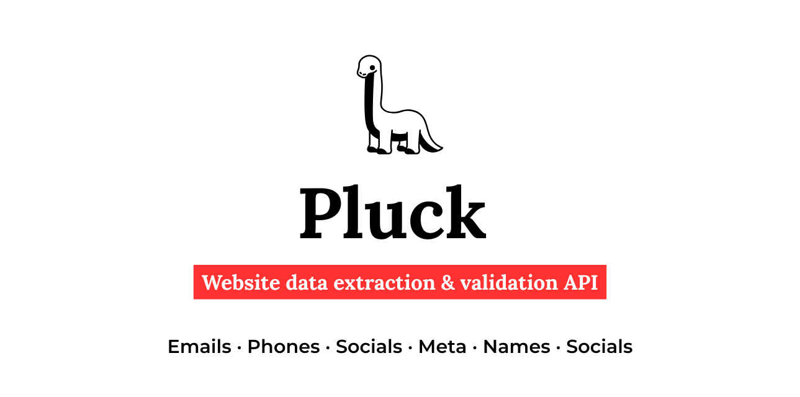

<p align="center">
  <strong>Extract and verify data from any webpage</strong>
  <br>
  Lightweight · Fast · Open source
</p>

<p align="center">
  <a href="https://www.typescriptlang.org"></a>
  <a href="https://hono.dev"></a>
  <a href="https://github.com/cheeriojs/cheerio"></a>
  <a href="LICENSE"></a>
  <a href="#"></a>
  <br>
  <a href="#"></a>
  <a href="#"></a>
</p>

---

## One API call

```bash
curl "http://localhost:3000/v1/scrape?url=https://example.com&emails=true"
```

Returns clean JSON. Toggle what you need.

---

## Endpoints

| Method | Path | Description |
|---|---|---|
| `GET` | `/` | Health check |
| `GET` | `/v1/scrape?url=...&emails=true` | Fetch URL → extract data |
| `POST` | `/v1/extract` | Submit raw HTML → extract data |
| `POST` | `/v1/batch` | Extract from multiple URLs |

---

## Quick start

```bash
npm install
npm run dev
```

Server starts on `http://localhost:3000`.

---

## Toggle params

Every endpoint accepts these. Default: `true`.

| Param | What it extracts | Sources |
|---|---|---|
| `emails` | Email addresses | `mailto:`, text regex, obfuscated `[at]` `[dot]`, JSON-LD |
| `phones` | Phone numbers | `tel:`, intl formats, JSON-LD — normalized to E.164 |
| `domains` | External domains | `<a href>`, `<link>` — any TLD |
| `socials` | Social media links | 17 platforms |
| `meta` | Page metadata | title, description, OG, Twitter Cards, canonical, charset, favicon, lang, author, keywords |
| `names` | Person names + titles | JSON-LD `Person`, `meta[author]`, team HTML structure, email proximity |

**Example — only emails and names:**

```bash
curl "http://localhost:3000/v1/scrape?url=https://news.ycombinator.com&emails=true&names=true&phones=false&socials=false&meta=false&domains=false"
```

---

## Social platforms detected

LinkedIn · Twitter/X · GitHub · Facebook · Instagram · YouTube · TikTok · Reddit · Discord · Telegram · WhatsApp · Pinterest · Medium · Twitch · Bluesky · Mastodon · Threads

---

## Batch mode

```bash
curl -X POST http://localhost:3000/v1/batch \
  -H "Content-Type: application/json" \
  -d '{ "urls": ["https://site1.com", "https://site2.com"], "emails": true }'
```

Up to 25 URLs per request. 5 concurrent workers. Returns array of results.

---

## Raw HTML mode

Already have HTML? No problem.

```bash
curl -X POST http://localhost:3000/v1/extract \
  -H "Content-Type: application/json" \
  -d '{ "html": "<html>...<a href=\"mailto:user@example.com\">email</a></html>", "emails": true }'
```

---

## Configuration

| Env var | Default | Description |
|---|---|---|
| `PORT` | `3000` | Server port |

Edit [`src/config.ts`](src/config.ts) for: `fetchTimeout`, `maxResultsPerField`, `maxBatchSize`, `batchConcurrency`, `socialPlatforms`.

---

## Deploy

```bash
# Docker
docker build -t pluck .
docker run -p 3000:3000 pluck

# Node
npm run build
npm run start:prod
```

---

## Project size

| Metric | Value |
|---|---|
| Core size | ~62KB |
| Source files | 12 |
| Tests | 27 passing |
| Dependencies | hono, cheerio, zod, @hono/node-server |

---

## Test

```bash
npm test
```

---

## License

[MIT](LICENSE)
